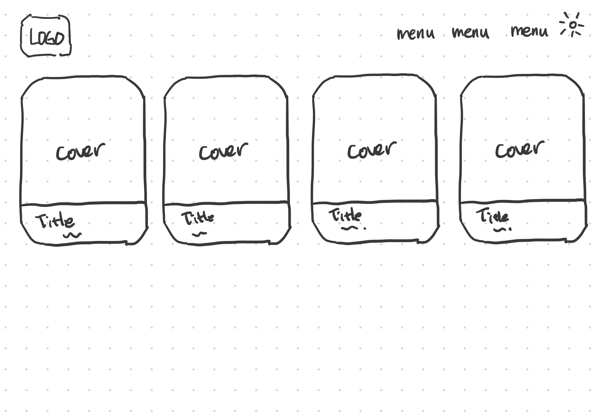

# summer-react-blog
- react와 typescript를 사용한 개인 블로그 제작

---   
# 목차
- [설계](#설계)
- [기능](#기능)
- [구현](#구현)
- [트러블슈팅](#트러블슈팅)
---   

# 설계
## 목표
- react, typescript 사용한 블로그 제작
- firebase api사용해 콘텐츠 생성, 배포
- tailwind로 데이/나이트 테마 구현

## 레이아웃
###  메인 페이지
- 헤더 : 로고, 메뉴(post, about me), 테마변경 아이콘
- 글 목록 : 커버이미지, 글 제목, 내용, 카테고리

### 메뉴
#### post
- 카테고리 분류
- 글 목록
- toc

### about me
- 소개글
- 프로젝트 목록

---
# 기능
🌱
---
# 구현
🌱
---
# 트러블슈팅
🌱